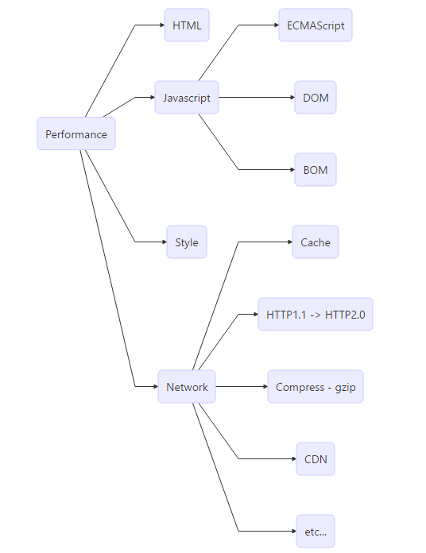

[TOC]
- 前言
  - 性能模型
- Basic
  - 浏览器渲染原理
  - Render
    - 标准渲染模型
  - Layout (Reflow in Firefox)
    - Forced synchronous layouts
  - Paint
  - Composite 渲染层合并
  - Jank or Janky
  - 渲染过程
    - reflow过程
    - re-paint过程
    - re-composite过程
    - CSS属性的性质
  - 优化目标
  - 优化方案
  - `window.requestAnimationFrame(handler:Function)`
  - `window.requestIdleCallback(handler:Function, forceExecuteTime:Number)`
- ExtJS
  - event listeners
    - 1. 确保事件监听只绑定一次
    - 2. 单次监听
    - 3. render
  - 不要使用`doLayout()`和`doComponentLayout()`
    - `doLayout()`的机制
  - 减少`container`嵌套
  - 减少读写DOM
    - 暂停布局
    - `Container`的暂停布局
- airbnb
- React
  - `Virtual DOM`
  - 性能优化入口

----

# 前言
性能问题涉及到方方面面:




本文主要针对`DOM`部分

## 性能模型


# Basic

## 浏览器渲染原理


## Render
分为:
- Layout
- Paint

### 标准渲染模型


## Layout (Reflow in Firefox)
是浏览器计算页面上所有元素的位置和大小的过程.

Web的layout模型意味着一个元素可以影响其他元素, 如子元素或者兄弟节点甚至父元素

触发条件:
- 调整浏览器窗口大小
- 使用涉及`computed values`([w3c link][link1])的JS代码
- 从DOM中添加/删除元素
- 更改元素的`layout`属性

### Forced synchronous layouts
如今的浏览器非常智能, 他们会尽可能将所有的`DOM`变动集中成一个队列, 然后一次性处理, 从而避免多次`reflow`

例如:
```js
div.style.color = 'blue';
div.style.marginTop = '30px';
```
> 这只会触发一次`reflow`

但是,
```js
div.style.color = 'blue';
var margin = parseInt(div.style.marginTop);
div.style.marginTop = (margin + 10) + 'px';
```
> 第二行要读取DOM的属性, 所以导致浏览器不得不立即`reflow`, 最终导致了两次`reflow`

如果在一个`frame`完成前, 从DOM请求一个几何值, 就会触发`Forced synchronous layouts`

这是一个巨大的性能瓶颈

## Paint
填充像素的过程, 包括绘制文字、颜色、图像、边框、阴影等，也就是一个DOM元素的所有可视效果。一般情况下，这个绘制过程是在多个层上完成的。

## Composite 渲染层合并
在多个层上绘制之后，要将所有层按照合理的顺序合并成一个图层，然后显示到屏幕上。

对于层叠的元素（css-层叠样式表），这个合并图层的顺序影响着元素的显示与否。

## Jank or Janky
指糟糕的性能问题

----

## 渲染过程

### reflow过程


如果修改一个DOM的`layout`属性，如宽高位置等，那么浏览器会检查哪些元素需要重新布局，触发一次`reflow`来重新布局，然后`paint`，最后`composite`

### re-paint过程


如果修改一个DOM的`paint only`属性，如背景图片、文字颜色、阴影等，这些不会影响页面的布局的属性，浏览器会跳过`layout`过程

### re-composite过程


如果修改一个`composite only`属性,浏览器会跳过`layout`和`paint`, 直接渲染层合并, 如`transform`/`opacity`


### CSS属性的性质
最理想的情况, 我们希望尽可能使用`composite only`属性, 其次优先使用`paint only`属性

[csstriggers](https://csstriggers.com/)

## 优化目标
目前大多数显示器刷新率为60Hz, 为了节省电力, 浏览器最高渲染频率也遵循60FPS(frame per second)

每秒进行60次`render`(如果需要), 每次`render`时间不超过16.66ms

## 优化方案
1. DOM属性读写分离
2. 尽量通过`class`来一次性改变样式
3. 使用`Document Fragment`, 操作结束后, 将`Fragment`加入DOM中
4. 尽量使用`cloneNode()`
5. 对于DOM操作次数多的情况, 先将元素`display: none`(1次`reflow`), 然后对DOM进行操作, 最后将元素显示出来(1次`reflow`)
6. `position`属性是`absolute`和`fixed`的元素, `reflow`开销比较小, 因为不需要考虑对其他元素的影响
7. 使用`Web Worker`, 主线程用于UI渲染, 其他任务交给Worker线程处理
8. 使用`requestAnimationFrame()`和`requestIdleCallback()`
9. 使用`React`

----

## `window.requestAnimationFrame(handler:Function)`
首先解决`setTimeout()`和`setInterval()`的弊病, 他们的延时执行, 都是在指定的时间点将`handler`代码加入到线程队列中等待执行, 如果当前线程队列繁忙, 那么`handler`实际执行时间会晚于期望时间.

并且, `setTimeout()`和`setInterval()`的最小精度是4ms

用上述两种方法实现动画, 如果当前线程队列非常繁忙, 会导致动画代码无法及时执行, 造成FPS降低, 动画卡顿.

`requestAnimationFrame()`将`handler`在下一次屏幕重绘时执行, 避免了在两次重绘之间多次修改DOM样式造成无用的性能开销.

```js
var degrees = 0;
function update() {
  div.style.transform = `rotate(${degrees}deg)`;
  console.log(`updated to degrees ${degrees}`);
  degrees = degrees + 1;
  window.requestAnimationFrame(update);
}
window.requestAnimationFrame(update);
```

## `window.requestIdleCallback(handler:Function, forceExecuteTime:Number)`
当一帧的末尾有空闲, 就执行`handler`函数

如果当前帧运行时间大于16.66ms, `handler`会推迟到有空闲的下一帧

`handler`函数可以接收一个对象`deadline`, 拥有两个成员:
- `timeRemaining()`返回当前帧剩余毫秒数, 只读.
- `didTimeout`属性, `Boolean`类型, 表示指定的时间`forceExecuteTime`是否过期

```js
requestIdleCallback(function someHeavyComputation(deadline) {
  while(deadline.timeRemaining() > 0) {
    doWorkIfNeeded();
  }

  if(thereIsMoreWorkToDo) {
    requestIdleCallback(someHeavyComputation);
  }
});
```

----

# ExtJS

## event listeners

### 1. 确保事件监听只绑定一次
多次绑定会造成严重的性能问题

尤其注意在类初始化函数中的监听绑定行为

### 2. 单次监听
如果只需要`handler`执行一次, 使用`single: true`

```js
listeners: {
    load: onFirstLoadData,
    single: true
}
```

### 3. render
`afterrender`事件在所有DOM元素存在后触发, 这时再修改DOM会导致`reflow`, 会有严重的性能损耗

尽可能使用`beforerender`事件, 在渲染之前操作DOM, 如修改`class`和`style`

一些需要获取元素尺寸的代码必须在`afterrender`执行


## 不要使用`doLayout()`和`doComponentLayout()`
尽可能移除这些调用, 他们消耗非常昂贵的性能

官方说, 如果你发现必须要调用这两个函数, 请提交bug报告, 他们会修复

唯一可能调用他们的情况就是应用代码要直接修改DOM, 由于框架不知道这种更改, 所以需要手动调用来更新受影响的布局.

### `doLayout()`的机制
触发框架调用条件:
- 调整容器大小
- 添加/删除子组件


`doLayout`是递归算法, 当一个组件被调用了`doLayout`, 将会递归所有子组件调用他们自身的`doLayout`

## 减少`container`嵌套
这会减少初始化, 渲染, 布局组件的时间


## 减少读写DOM
读取DOM会导致程序变慢, 而读写的组合更是会导致`reflow`

### 暂停布局
`Ext.suspendLayouts()` 与 `Ext.resumeLayouts()`

```js
Ext.suspendLayouts();
// batch of updates
Ext.resumeLayouts(true);
```

> 例如: 向两个容器连续添加多个items, 会导致执行多次`layout`和`render`;
如果在添加items之前调用`suspendLayout()`, 框架将不会为每个单独的item执行`layout`操作;
当操作完, 调用`resumeLayouts()`, 框架会执行一次`render`和`layout`


### `Container`的暂停布局
`Container.suspendLayout`

```js
var containerPanel = Ext.create('Ext.panel.Panel', {
    renderTo: Ext.getBody(),
    width: 400,
    height: 200,
    title: 'Container Panel',
    layout: 'column',
    suspendLayout: true // Suspend automatic layouts while we do several different things that could trigger a layout on their own
});
// Add a couple of child items.  We could add these both at the same time by passing an array to add(),
// but lets pretend we needed to add them separately for some reason.
containerPanel.add({
    xtype: 'panel',
    title: 'Child Panel 1',
    height: 100,
    columnWidth: 0.5
});
containerPanel.add({
    xtype: 'panel',
    title: 'Child Panel 2',
    height: 100,
    columnWidth: 0.5
});
// Turn the suspendLayout flag off.
containerPanel.suspendLayout = false;
// Trigger a layout.
containerPanel.doLayout();
```

----

# airbnb
> 关于ECMAScript

[Link][link2]

----

# React

## `Virtual DOM`
屏蔽了手动DOM操作, 所有对于DOM的操作都作用于`Virtual DOM`上, 由`React`自动更新真实DOM

将DOM性能问题转化为`render()`优化

## 性能优化入口
`shouldComponentUpdate(nextProps:Object, nextState:Object): boolean`

这是一个`leftcycle`函数, 在组件接收到新的`props`或`state`, `render`之前调用. 不会再初始化`initial render`或`forceUpdate()`时调用.

这是一个性能优化的好时机, 如果觉得`newProps`或`newState`并不需要更新组件, 可以在该方法中返回`false`来阻止触发`render()`.

----

[link1]: https://www.w3.org/TR/1998/REC-CSS2-19980512/cascade.html#computed-value
[link2]: https://github.com/airbnb/javascript#performance
